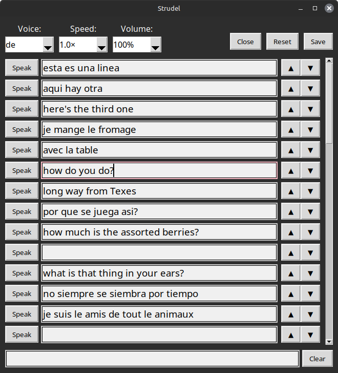
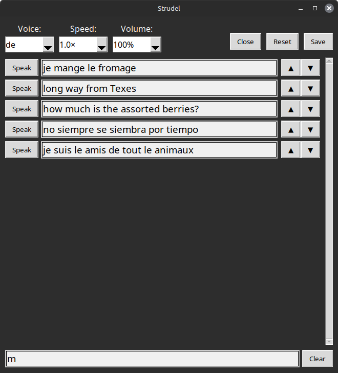

This is a simple soundboard.

Just enter text and press `Speak` to use that line.

It started as an idea to create an accesibility tool for people who can't speak.

But I'll probably just use it for fun myself.

There are no libraries needed, you just need `tk` installed.

It uses `espeak` for speech synthesis.

There are buttons to move items up and down.

The `Save` button must be used to save the state.

There is a filter at the bottom that do various things.

First it can filter out inputs to pick one.

But a number can also be used, for example 3 for the third input.

And if no input is shown, it will speak the written text when Enter is pressed.