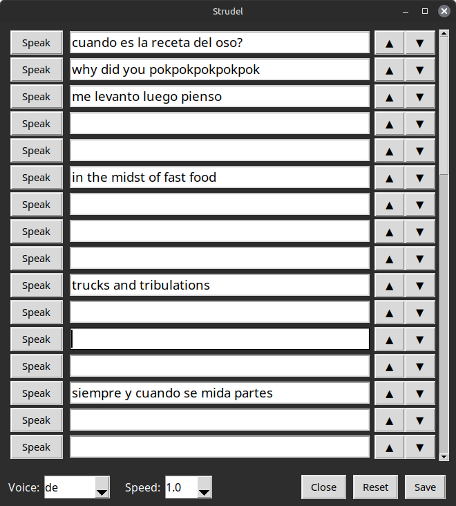

This is a simple soundboard.

Just enter text and press Speak to use that line.

It started as an idea to create an accesibility tool for people who can't speak.

But I'll probably just use it for fun myself.

There are no libraries needed, you just need `tk` installed.